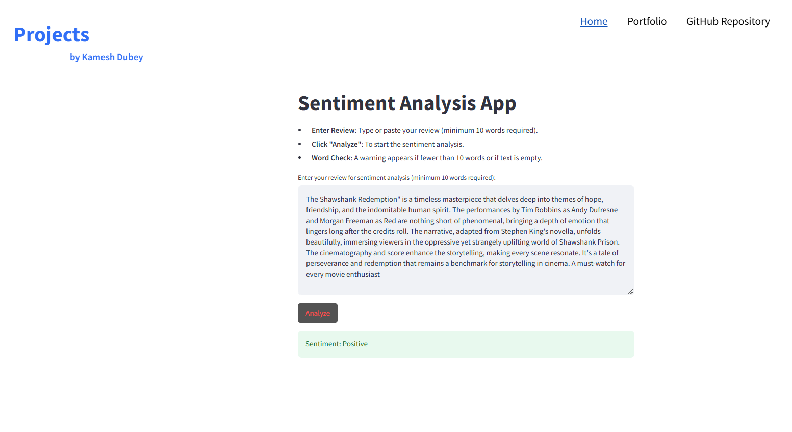
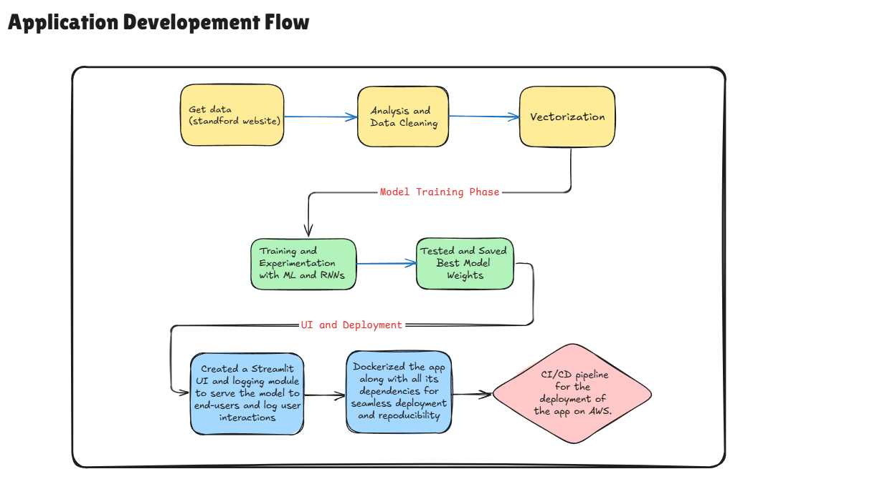

# Sentiment Analysis App

## Overview

This repository hosts a **Sentiment Analysis App** designed to predict the sentiment (positive or negative) of movie reviews. The app uses Docker for easy setup and consistent usage across different environments.
The core model in this app is an **LSTM-based neural network** with a **TF-IDF vectorizer** for text data preprocessing. The dataset used for training is sourced from the [Stanford Large Movie Review Dataset](http://ai.stanford.edu/~amaas/data/sentiment/aclImdb_v1.tar.gz).

Throughout the development, I experimented with various models, including Vanilla RNN and GRU, but found LSTM to be the most effective in terms of performance and stability.



---

## Features

- **Streamlit Interface**: Interactive, user-friendly interface for uploading and analyzing reviews.
- **Sentiment Prediction**: Classifies movie reviews as positive or negative.
- **LSTM Model**: The primary model architecture used for sentiment classification.
- **Dockerized Deployment**: Simple, containerized setup with `docker-compose` for reproducibility.
- **Model Comparisons**: Tested with different architectures (Vanilla RNN, GRU) to achieve the best performance.

---

## Getting Started

### Prerequisites

- [Docker](https://docs.docker.com/get-docker/)
- [Docker Compose](https://docs.docker.com/compose/install/)

### Setup and Run

1. **Clone the Repository**:

   ```bash
   git clone https://github.com/your-username/sentiment-analysis-app.git
   cd sentiment-analysis-app
   ```

2. **Download the Dataset**: Download and extract the [Stanford Large Movie Review Dataset](http://ai.stanford.edu/~amaas/data/sentiment/aclImdb_v1.tar.gz). Place the data in the `data` folder within this repository.

3. **Build and Run Docker Containers**: Using `docker-compose`, you can set up and start the app by running:

   ```bash
    docker-compose up --build
   ```

This command will:

- Build Docker images for the app and its dependencies.
- Launch the Streamlit app in a containerized environment.
- Provide a fully operational app at [localhost:8502](http://localhost:8502).

## Usage

- **Input**: Upload or type a review for sentiment analysis.
- **Analyze**: Click on "Analyze" to see the sentiment (positive or negative) prediction.
  - **Note**: The analysis button activates only when the input review contains at least 10 words.
- **Navigation**: If you are on the home page, click on the "App" tab to go to the app page.

## Model Details

- **Vectorization Technique**: We use **TF-IDF** vectorization to transform text data into numerical features.
- **Model Architecture**: The core model is an LSTM neural network, chosen for its ability to effectively capture sequential dependencies in the text.
- **Alternative Models**: During experimentation, I tested Vanilla RNN and GRU also, but LSTM yielded better results.

### Model Pipeline Flowchart

This flowchart illustrates the preprocessing, model training, and app development deployment steps. The app is Dockerized to ensure all dependencies are packaged for consistent deployment and easy reproducibility.



## Acknowledgments

The **Stanford Large Movie Review Dataset** was instrumental in training this model. Thanks to the creators for providing this dataset.
